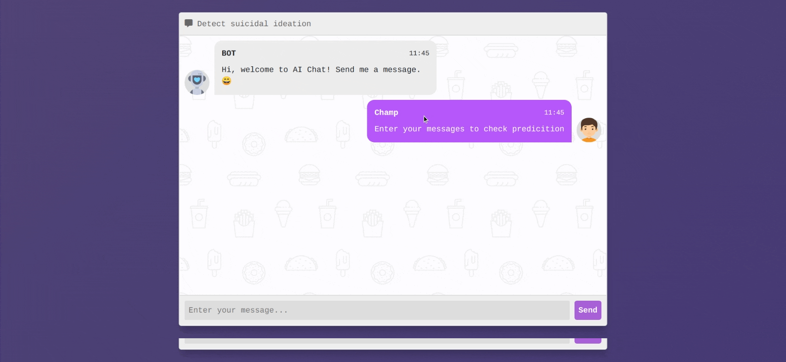
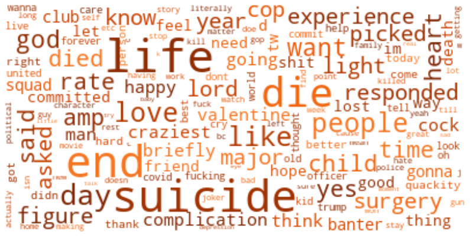
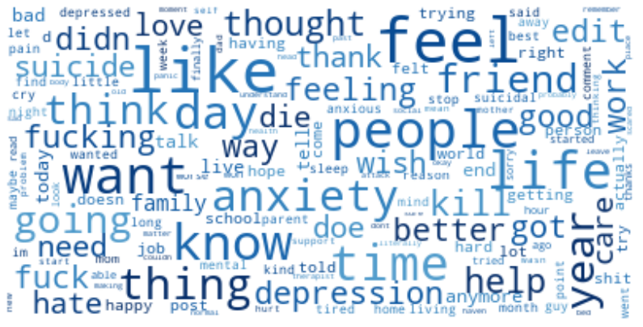

<div align="center">

# 🧠 AI for Social Good — ጉድ
### Multilingual Suicidal Ideation Detection for Ethiopian & Global Communities



[](LICENSE)
[](https://www.python.org/)
[](https://flask.palletsprojects.com/)
[](https://core.telegram.org/bots)

</div>

---

## 🌍 Overview

Mental health crises are a growing challenge worldwide — but especially in communities where **language barriers, stigma, and lack of resources** make it hard to get help. In Ethiopia alone, most mental health tools are English-only, leaving millions of Amharic, Afan Oromo, and Tigrinya speakers without access to early intervention.

**AI for Social Good (ጉድ)** is an end-to-end system that:

1. **Detects suicidal ideation** in social media posts (Reddit, Twitter) using classical ML and deep learning.
2. **Extends to Ethiopian languages** — Amharic, Afan Oromo, Tigrinya, and mixed text — using a fine-tuned multilingual transformer (`afro-xlmr-base`).
3. **Deploys a real-time Telegram bot** that listens, detects distress in any supported language, and instantly connects users to Ethiopian crisis helplines.
4. **Exposes a REST API** (Flask) for both English and multilingual Ethiopian crisis detection.

---

## 🏗️ Project Architecture

```
AI_For_Social_ጉድ/
│
├── 📁 Data_Collection/          # Scrapers for Reddit & Twitter
│   └── scraper/
│       ├── reddit.py            # PRAW-based Reddit scraper
│       └── tweets.py            # Twitter/X scraper
│
├── 📁 Dataset/                  # Raw & cleaned datasets
│   ├── RedditSuicideData.csv
│   ├── TwitterSuicideData.csv
│   └── mergedData.csv
│
├── 📁 Src/                      # Model training notebooks
│   ├── Text_Analysis_And_Cleaning.ipynb
│   ├── ML_Model.ipynb           # Random Forest + TF-IDF (96% acc)
│   ├── LSTM_Model.ipynb         # BiLSTM + GloVe (97% acc)
│   └── Models_Testing.ipynb
│
├── 📁 Pretrained_Models/        # Saved English models & tokenizers
│   ├── random_forest.pkl
│   ├── lstm.h5
│   ├── tfidf_tokenizer.pkl
│   └── tf_tokenizer.pkl
│
├── 📁 Ethiopia/                 # Ethiopian multilingual extension
│   ├── preprocessing/
│   │   ├── amharic_normalizer.py     # Amharic script normalization
│   │   └── multilingual_cleaner.py   # Cross-lingual text preprocessing
│   ├── Dataset/
│   │   └── generate_synthetic_seed.py
│   ├── Model/
│   │   ├── fine_tune_colab.py        # Fine-tune afro-xlmr-base on Colab
│   │   └── inference.py              # EthiopianCrisisDetector class
│   └── TelegramBot/
│       ├── bot.py                    # Full Telegram bot
│       └── config.py                 # Bot configuration
│
├── 📁 Flask/                    # REST API server
│   ├── app.py                   # Endpoints: /predict, /predict_ethiopian
│   ├── crisis_response.py       # Helpline data + response formatters
│   └── templates/index.html     # Web chat UI
│
└── 📁 WordClouds/               # Visualizations
```

---

## 📊 Datasets

Data was collected from **Reddit** and **Twitter/X** targeting mental health communities.

| Source  | Type              | Count  | Method                                      |
|---------|-------------------|--------|---------------------------------------------|
| Reddit  | Suicidal posts    | 2,958  | Subreddits: `r/SuicideWatch`, `r/depression`, `r/anxiety` |
| Reddit  | Non-suicidal posts| 5,381  | Subreddits: `r/happy`, `r/CasualConversation` |
| Twitter | Suicidal tweets   | 3,000  | Keywords: `end my life`, `want to die`, etc. |

**Word Clouds:**

<div align="center">
  
  &nbsp;&nbsp;
  
  <br/><em>Twitter (left) &nbsp;|&nbsp; Reddit (right)</em>
</div>

---

## 🤖 Models

### Phase 1 — English Models

Text is cleaned, tokenized, and passed through two parallel classifiers:

| Model             | Vectorizer   | Accuracy | Precision | Recall | F1   |
|-------------------|--------------|----------|-----------|--------|------|
| Random Forest     | TF-IDF       | 96%      | 0.96      | 0.96   | 0.96 |
| BiLSTM + GloVe    | Keras Tokenizer | 97%   | 0.97      | 0.97   | 0.97 |

### Phase 2 — Ethiopian Multilingual Model

Fine-tuned **`afro-xlmr-base`** on a multilingual Ethiopian dataset covering:

| Language    | Script     | Code |
|-------------|------------|------|
| Amharic     | Ge'ez ( ethiopic) | `am` |
| Afan Oromo  | Latin      | `om` |
| Tigrinya    | Ge'ez      | `ti` |
| English     | Latin      | `en` |
| Mixed       | Both       | `mixed` |

Falls back to a **keyword heuristic** classifier when the fine-tuned model is not available locally.

---

## 🚀 Getting Started

### Prerequisites

```bash
pip install -r Flask/requirements.txt
```

### Environment Setup

Copy `.env.example` to `.env` and fill in your credentials:

```bash
cp .env.example .env
```

```env
REDDIT_CLIENT_ID=your_reddit_client_id
REDDIT_CLIENT_SECRET=your_reddit_client_secret
TELEGRAM_BOT_TOKEN=your_telegram_bot_token
```

### Run the Flask API

```bash
cd Flask
python app.py
```

The server starts at `http://localhost:5000`

**Endpoints:**

| Method | Route                  | Description                          |
|--------|------------------------|--------------------------------------|
| `GET`  | `/`                    | Web chat UI                          |
| `POST` | `/predict`             | English model (RF + BiLSTM)          |
| `POST` | `/predict_ethiopian`   | Ethiopian multilingual detection     |
| `GET`  | `/health`              | Health check                         |

**Example request:**

```bash
curl -X POST http://localhost:5000/predict_ethiopian \
  -H "Content-Type: application/json" \
  -d '{"text": "ህይወት መረረኝ ብቻ ሆኜ ዋጋ የለኝም"}'
```

**Example response:**

```json
{
  "status": 200,
  "is_crisis": true,
  "risk_level": "HIGH",
  "confidence": 0.92,
  "lang": "am",
  "method": "model",
  "crisis_response": {
    "message": "...",
    "helplines": ["8335", "011-275-3300"]
  }
}
```

### Run the Telegram Bot

```bash
cd Ethiopia/TelegramBot
python bot.py
```

**Bot commands:**

| Command       | Description                              |
|---------------|------------------------------------------|
| `/start`      | Welcome message (Amharic + English)      |
| `/help`       | How to use the bot                       |
| `/resources`  | All Ethiopian mental health helplines    |
| `/about`      | About this project                       |

---

## 🇪🇹 Ethiopian Crisis Helplines

| Service                         | Number           |
|---------------------------------|------------------|
| 📞 Health Hotline (Free)        | **8335**         |
| 🏥 Amanuel Mental Hospital      | 011-275-3300     |
| 🚑 Ethiopian Red Cross          | 011-551-5166     |
| 🚔 Police Emergency             | 991              |

---

## 🔬 Fine-tuning the Ethiopian Model

Run `Ethiopia/Model/fine_tune_colab.py` on Google Colab (free GPU):

```python
# On Google Colab:
!python Ethiopia/Model/fine_tune_colab.py
```

This fine-tunes `afro-xlmr-base` on the multilingual crisis dataset and saves the model to `Ethiopia/Model/ethiopian_crisis_model/`.

---

## 📁 Repository Structure Quick Reference

| Folder              | Purpose                                      |
|---------------------|----------------------------------------------|
| `Data_Collection/`  | Social media scrapers (Reddit, Twitter)      |
| `Dataset/`          | Raw & cleaned datasets (CSV)                 |
| `Src/`              | Jupyter notebooks for training English models|
| `Pretrained_Models/`| Saved English model files                    |
| `Ethiopia/`         | Multilingual extension & Telegram bot        |
| `Flask/`            | REST API server & web UI                     |
| `WordClouds/`       | Word cloud visualizations                    |

---

## 👤 Author & Maintainer

**Robel Tesfaye**
- GitHub: [@Riter-Rob](https://github.com/Riter-Rob)
- Repository: [Ai_for_social_-](https://github.com/Riter-Rob/Ai_for_social_-)

---

## 📄 License

Distributed under the **MIT License**. See [`LICENSE`](LICENSE) for more information.

---

<div align="center">
  <em>Built with 💙 for Ethiopia and beyond — ለኢትዮጵያ እና ከዚያ ያለፈ</em>
</div>
